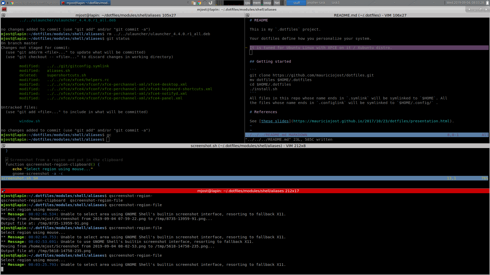
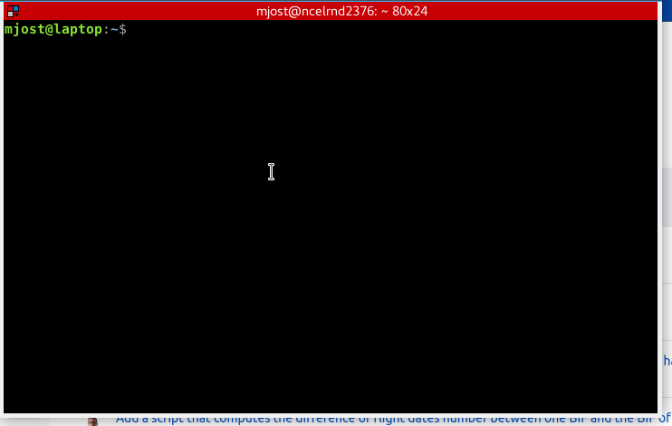

# README 

This is my `.dotfiles` project. 

Your dotfiles define how you personalize your system. 

It is tuned for *Ubuntu Linux* with *XFCE* on it / *Xubuntu* distro.

It looks as follows:




## Features

- organized shell aliases and functions to help me with the commands (and its flags) that I often find useful
- handy docs and code snippets I often need & forget
- settings of XFCE4 window manager that suit daily life and work (task oriented using workspaces)
- handy markdown based notes, editable via `vim` (called *topics*)
    - syntax highlighting optimized for taking fast notes (todos, conclussions, references, simple calculations, etc.)
    - create (in a single command) a name & dated note
    - create a Scrum daily report, with a customizable template
    - same way create a Scrum retrospective document
    - same way create meeting minutes document
    - publish any note / topic into Confluence or Google Keep
- relies on Ulauncher for quick application starts
    - can launch commands or aliases from it
    - can be easily customized to open predefined pre-filled URLs
- named workspace oriented window manager
    - workspace name can be easily modified with a few keystrokes
    - workspace name is part of command history
- smart history that keeps full context of command executed (date, time, id of the console, id of the workspace, directory)
- full integration with fzf 
    - perform `cd` / go to a directory in a few keystrokes (stop typing `cd`s in the console)
    - history search using `fzf` and set command into console for modification / execution
    - topic / notes search using `fzf`
    - code snippets search using `fzf`
    - 
    - ...
- and more!

## Getting started

```
git clone https://github.com/mauriciojost/dotfiles.git
mv dotfiles $HOME/.dotfiles
cd $HOME/.dotfiles
./install.sh
```
All files in this repo whose name ends in `.symlink` will be symlinked to `$HOME`. All 
the files whose name ends in `.configlink` will be symlinked to `$HOME/.config/` .

# References

See [these slides](https://mauriciojost.github.io/2017/10/23/dotfiles/presentation.html) I wrote to explain a bit what *dotfiles* are and why you may be interested.
